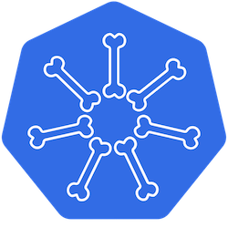

# Backbone - Lightweight AuthZ, AuthN and IdP for K8s apps

A super simple, easy to use, Kubernetes native, identity and access management backbone for POCs, demos, student
projects and to kickstart startups.    
Backbone relies on the k8s etcd to store its data, and will rely on in-memory caching.
Due to these facts, it is not recommended to create more than 1 replica or to create too many resources.

| Feature                                        | Supported? | When?       |
|------------------------------------------------|------------|-------------|
| Act as a simple Sessions server (cookie based) | V          | In Progress |
| Act as an OpenID Connect server (with OAuth)   | V          | TBD         |
| Act as a broker to other IdPs via OIDC         | V          | TBD         |
| SAML                                           | X          | Not planned |
| User Roles                                     | V          | In progress | 
| Permissions                                    | V          | In progress |
